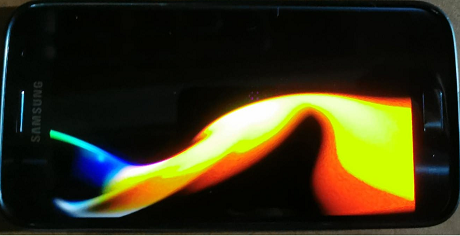

# GZE_ShaderToy
Simple direct [Shadertoy](https://www.shadertoy.com/view/wlyXzm) Implementation on GZE

## Test our C~ thematic shader live under WebGL:
## 

***

#### Work also on Android with the new [DroidRT](https://github.com/VLianceTool/DroidRT) toolchain:
## 
